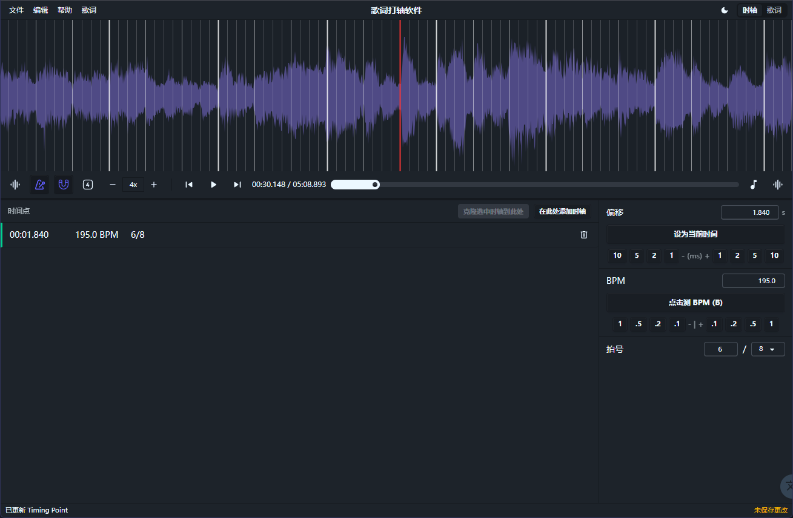
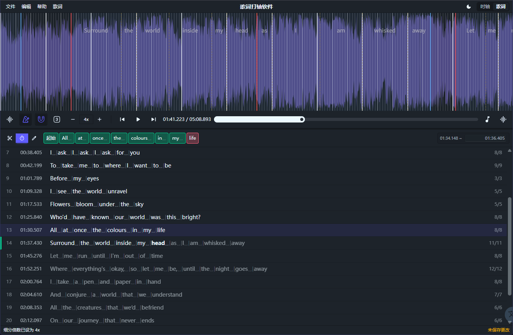

<!-- markdownlint-disable MD028 -->

# Lyrics Maker

> [!WARNING]
> 当前项目为纯 AI Vibe Coding 产出，代码质量可能不尽人意，仅作为本 Vibe Coding 新手上手练习的尝试成果。

> [!NOTE]
> 虽说是这样，我也有付出时间认真打磨这个项目的一些细节。  
> 我做出来的东西无人问津的话，我会很失落，我在这个项目里烧掉的 Token 与废掉的时间都是没有意义的。  
> 如果你喜欢这个项目，衷心感谢。欢迎反馈和提出建议。

Lyrics Maker（暂定名）是一个运行在浏览器里的歌词打轴编辑器，用于导入本地音频、编辑歌词，并在波形或频谱时间线上完成逐句、逐词的时间标记。

项目借鉴了 osu!lazer editor Timing 模式与 Aegisub，特色是可以将句子或词吸附到以小节线为基准的网格系统上。

**点这里 -> [在线尝试](https://lrc.lgck.cc)**

## 功能概览

- 导入本地音频，支持播放、暂停、进度跳转、音量调节与节拍器。
- 管理 BPM、拍号、偏移等 timing points，并支持 Tap BPM 辅助估算。
- 在波形 / 频谱视图中查看时间线、网格、播放指针和歌词覆盖层。
- 粘贴歌词后自动分词，支持切词、合词、编辑文本。
- 歌词打轴模式支持快捷键标记行起点与词结束时间。
- 所有可编辑操作通过命令历史管理，支持撤销 / 重做。

当前已完成基础架构、音频与 timing core、时间线视图、歌词打轴等核心能力；后续重点是导入导出插件、快捷键重绑定 UI 和更多工程工作流。

项目尚未开发完成，目前剩余的待实现功能记录在 [这里](docs/phase-5-plus-stepped-spec.md)。更多设计记录见 [这里](docs/design.md)。
