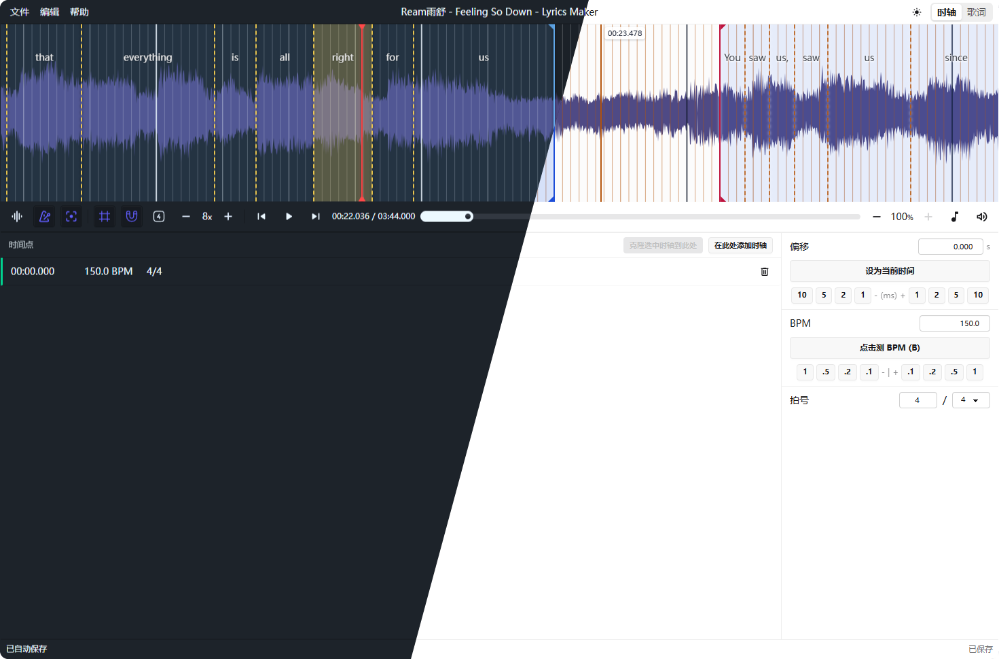
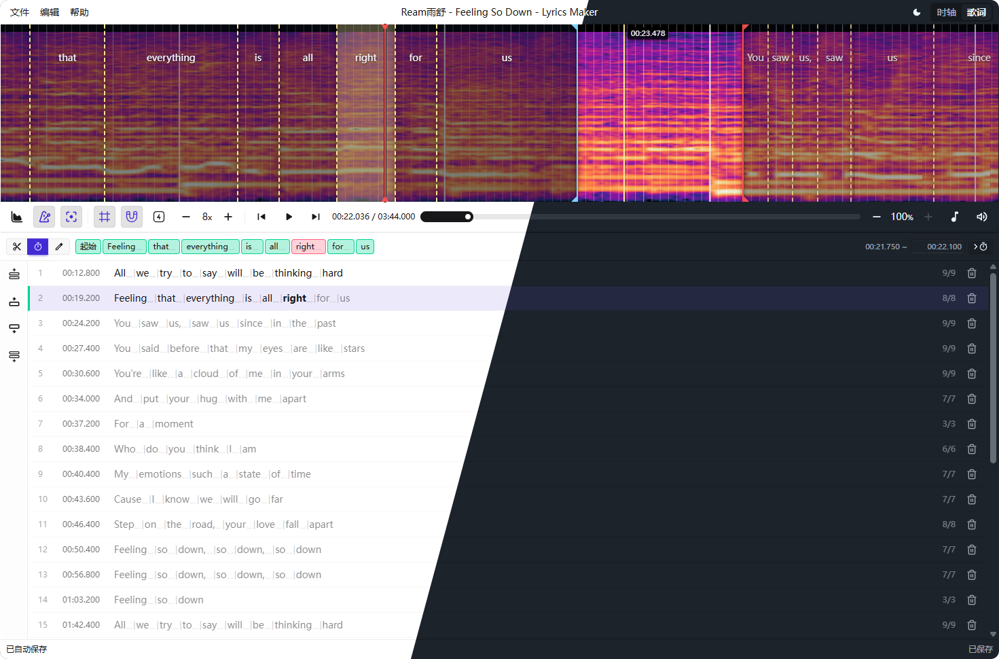

<!-- markdownlint-disable MD028 MD033 -->

# Lyrics Maker

**简体中文** | [English](README.en.md)

> [!WARNING]
> 当前项目为纯 AI Vibe Coding 产出，代码质量可能不尽人意，仅作为本 Vibe Coding 新手上手练习的尝试成果。

> [!NOTE]
> 虽说是这样，我也有付出时间认真打磨这个项目的一些细节。  
> 我做出来的东西无人问津的话，我会很失落，我在这个项目里烧掉的 Token 与废掉的时间都是没有意义的。  
> 如果你喜欢这个项目，衷心感谢。欢迎反馈和提出建议。

Lyrics Maker 是一款专注于歌词时间轴制作的 Web 工具。导入音频、粘贴歌词，在波形或频谱时间线上完成逐句、逐词的打轴与编辑，最后导出为标准歌词/字幕格式。

**✨ 即刻体验：[lrc.lgck.cc](https://lrc.lgck.cc)**

## 📸 预览

  
  

## ✨ 功能亮点

### 🥁 节拍网格打轴

借鉴 osu!lazer Editor 的 Timing 系统，将歌词边界吸附到由 BPM、拍号、偏移和细分倍数生成的节拍网格上，特别适合处理节奏明确的歌曲。

- **Timing Point 管理**：在任意位置插入 BPM 变更点或拍号变更点，灵活应对变速歌曲
- **Tap BPM**：跟随音乐敲击按键，自动估算 BPM
- **灵活吸附**：支持 1/2、1/4、1/8、1/16 等细分精度，以及三连音

### 🎛️ 波形与频谱双视图

在主时间线区域自由切换波形和频谱两种视图，配合多种覆盖层辅助精确编辑：

- **播放指针**：实时跟随音频播放位置
- **节拍网格覆盖层**：可视化小节线和拍线，直观看到吸附目标
- **歌词覆盖层**：在时间线上直接显示已打轴的歌词句块与词块，支持拖拽调整边界
- **鼠标时间预览**：悬停时预览当前鼠标位置对应的时间

### ✍️ 逐句 + 逐词编辑

从整句到逐词，提供完整的两级编辑能力：

- **逐句打轴**：为每句歌词标记起止时间
- **逐词打轴**：在句子内部为每个词精细标记时间
- **自由切词**：英文自动按空格分词，支持手动调整切分
- **拖拽编辑**：在时间线覆盖层上直接拖拽句子边界或词边界，所见即所得
- **完整撤销/重做**：所有编辑操作均可撤销和重做

### 📂 多格式导入导出

支持丰富的歌词和字幕格式，打通不同工具链：

| 类别   | 格式                                    |
| ------ | --------------------------------------- |
| 纯文本 | TXT                                     |
| 歌词   | LRC（普通 / 增强 / ESLyric）、AMLL TTML |
| 字幕   | ASS、SRT、VTT                           |
| 工程   | JSON（保存完整编辑状态）                |

### 🎨 可自定义的编辑体验

将编辑器调成你喜欢的样子：

- **主题**：亮色 / 暗色 / 跟随系统
- **语言**：英文 / 简体中文
- **快捷键**：绝大部分快捷键均可自定义，设置可备份与恢复

### 💾 本地优先

数据安全放在首位，所有操作在浏览器本地完成：

- 项目保存 / 另存为（File System Access API），每分钟自动保存到本地文件
- 打开已有工程文件
- 浏览器实时保存草稿，自动恢复
- 未保存更改提醒

## 🚀 快速上手

1. **导入音频** — 点击菜单栏「文件 → 打开音乐」，或直接将音频文件拖入窗口
2. **建立节拍网格** — 切换到「时轴模式」，使用 Tap BPM 跟随音乐敲击估算 BPM，或手动设置 BPM 与拍号
3. **导入歌词** — 切换到「歌词模式」，粘贴或导入歌词文本，使用 `Ctrl+D` 自动切词
4. **开始打轴** — 播放音频，按下 `D` 键逐词标记时间，按 `Enter` 结束当前句子
5. **精细调整** — 在时间线覆盖层上拖拽歌词边界微调
6. **导出成品** — 点击「文件 → 另存为」，选择 LRC 或其他格式导出

> 💡 所有快捷键均可在「首选项」中自定义。部分浏览器保留组合键（如 `Ctrl+D`）可能被浏览器拦截，可在设置中绑定替代键位。

## 📊 当前状态

核心编辑链路已贯通，以下功能均可正常使用：

- 音频播放、进度跳转、音量控制、节拍器、变速播放（25%/50%/75%/100%）
- Timing Point 管理、Tap BPM、吸附网格与网格显示控制
- 歌词粘贴、导入、切词、合词、行编辑、插入、删除
- 波形 / 频谱时间线、歌词覆盖层、覆盖层拖拽编辑
- 项目保存、自动草稿、未保存确认、项目校验
- 主题切换、语言切换、快捷键自定义、设置备份与恢复

> 📝 如果有人使用了这个项目并给出反馈，我会根据反馈持续打磨细节。详细设计记录见 [docs/design.md](docs/design.md)。

## 💬 反馈

如果你试用了这个项目，欢迎通过以下方式反馈问题、建议和使用体验：

- **GitHub Issues**：[提交 Issue](https://github.com/lgc2333/lyrics-maker/issues)
- **QQ**：3076823485 / 吹水群：[168603371](https://qm.qq.com/q/EikuZ5sP4G)
- **Telegram**：[@lgc2333](https://t.me/lgc2333)
- **邮箱**：[lgc2333@126.com](mailto:lgc2333@126.com)
